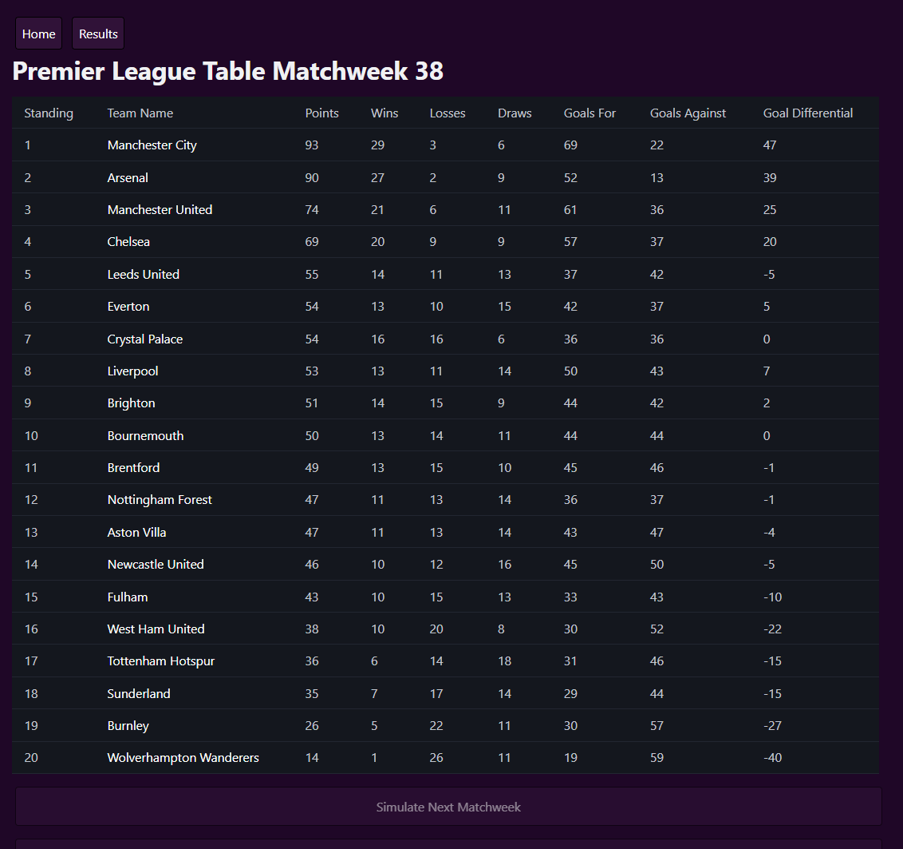
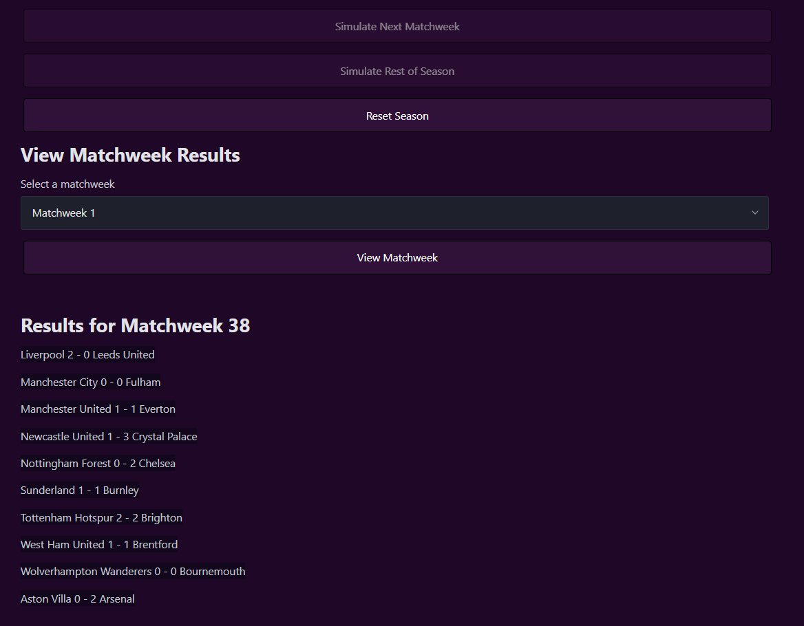
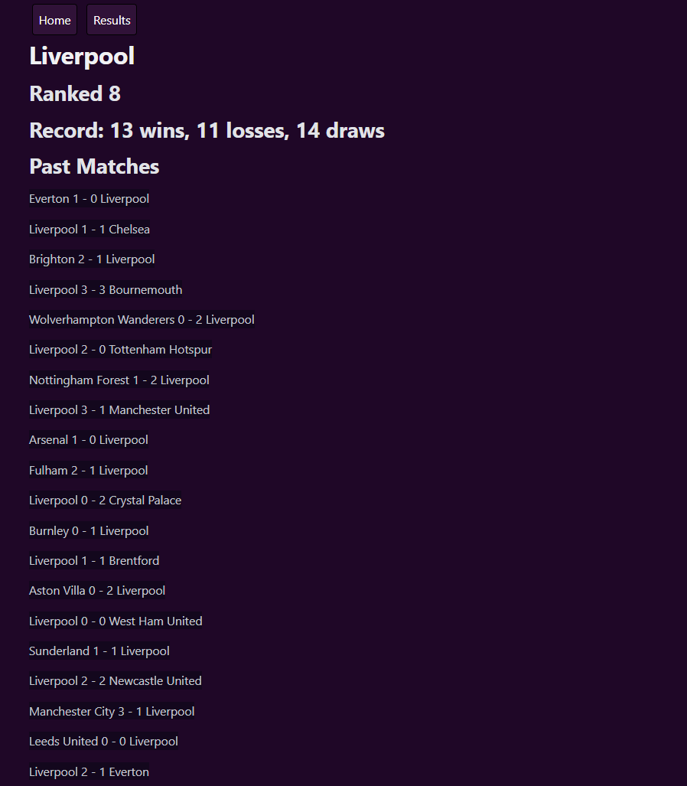
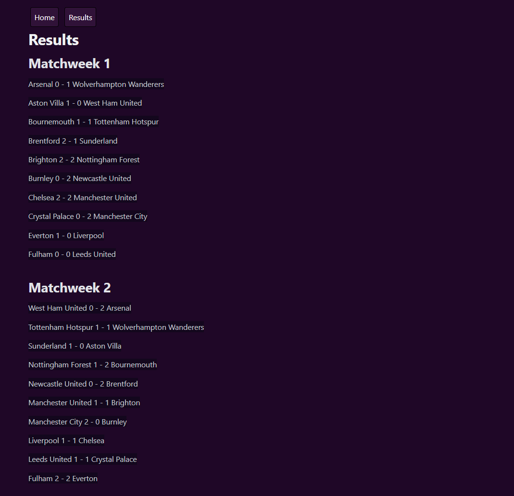
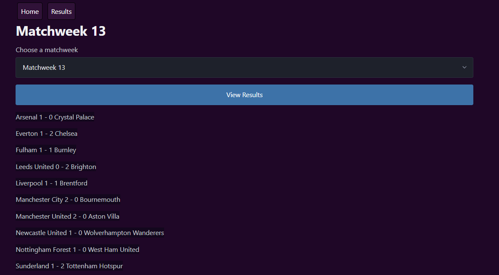

# Premier League Season Simulator

A web application built with Python, Flask, SQLite, HTML, CSS, and JavaScript that simulates an entire Premier League season. Users can simulate one gameweek at a time, view the updated league table, browse match results week by week or as a whole, and explore each team's season.

## Features

- Live Premier League standings
- Simulate the next gameweek with realistic score generation
- Standings sorted by Premier League tiebreakers (points, goal difference, goals scored)
- View results from the latest gameweek
- Individual pages for all 20 Premier League clubs
- SQLite database stores season progress even after the server is restarted
- Reset the season and start a new simulation

## How It Works

Each team is assigned attack and defensive ratings. When a gameweek is simulated, match scores are generated using these ratings along with random probability to create realistic outcomes.

After every match, the application updates:

- Games Played
- Wins, Draws, Losses
- Goals For and Against
- Goal Difference
- Points

The standings are then reordered according to the official Premier League rules.

## Running the Project

Note: Some commands may differ baced on the machine in use.

1. Open your browser and visit:

   https://premier-league-simulation-production.up.railway.app/

Or

1. Clone the repository:

```
git clone https://github.com/cprice2028/Premier-League-Simulation.git
```
You might need to install git before doing this if you haven't already

2. Navigate into the project folder:

```
cd Premier-League-Simulation
```
3. Install Dependencies:

```
python -m pip install -r requirements.txt
```

4. Set up the virtual environment

```
python3 -m venv venv
source venv/bin/activate
```

4. Run the application:

```
gunicorn app:app --bind 0.0.0.0:5000
```

5. Open your browser and visit:

   http://0.0.0.0:5000/

## Screenshots

### Home Page




Has the league table with all the basic statistics: points, wins, loses, draws, goals for, goals against, and goal differential. Also inludes the match scores for the current week of play.

### Team Page



Provides all the teams match results aswell as their overall record and rank in the league.

### Latest Results



Lists all the matches played in the season week by week.

### Matchweek History



Provides the match results for any match that you specify.

## Authors

- Charles Price
- Vihaan Madhavan